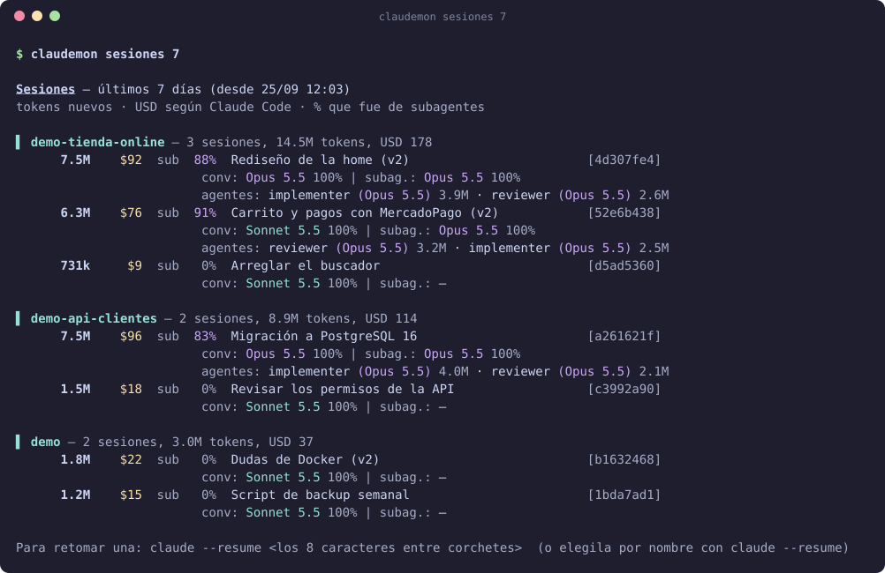
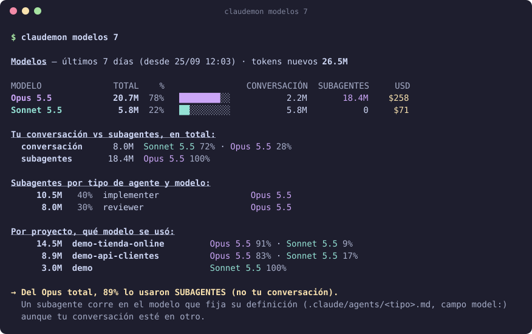
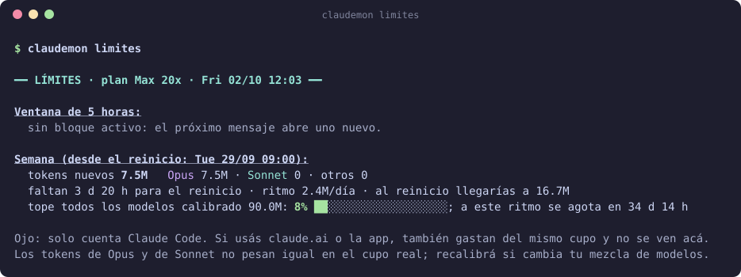
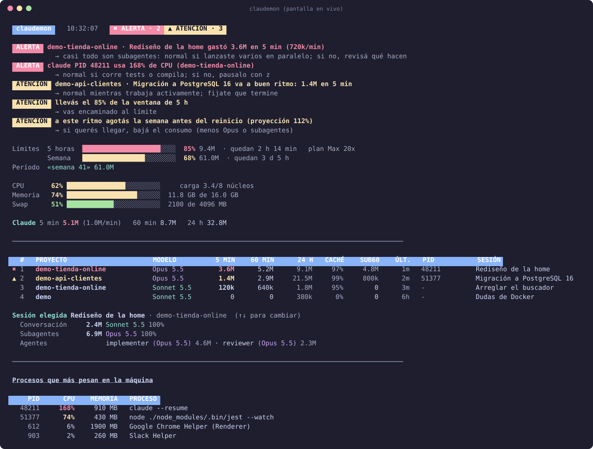

<div align="center">

# claudemon

**Descubrí qué sesión de Claude Code se come tu cupo, quién usa Opus y cuánto te queda en el plan.**

[](https://github.com/leonelvalentini/claudemon/actions/workflows/tests.yml)
[](LICENSE)
[](https://www.python.org/downloads/)


Un solo archivo · sin dependencias para los informes · todo se calcula en tu máquina

</div>

<p align="center"></p>

---

## ¿Para qué sirve?

Con un plan Pro o Max, Claude Code gasta de un cupo que no ves hasta que se acaba. `claudemon` lee los registros que Claude Code
ya guarda en tu computadora y te responde lo que `/usage` no dice:

| Pregunta | Comando |
|---|---|
| ¿Qué sesión o proyecto gastó más? (con su **nombre real** y USD) | `claudemon sesiones` |
| ¿Quién usó Opus: mi conversación o los **subagentes**? | `claudemon modelos` |
| ¿Cuánto llevo de la ventana de 5 h y de la semana? ¿Cuándo me quedo sin cupo? | `claudemon limites` |
| ¿Cuánto gasté desde que empecé a contar? | `claudemon uso` |
| ¿Qué sesión está saturando mi compu ahora mismo? | `claudemon` (pantalla en vivo) |
| ¿Cómo se ve todo esto, sin usar mis datos? | `claudemon demo` |

### Un caso típico

> *"Usé Sonnet casi todo el tiempo y aun así el consumo de Opus es enorme."*
>
> Eran los **subagentes**: un agente definido con `model: opus` corre en Opus aunque tu conversación esté en Sonnet.
> `claudemon modelos` lo separa y te dice qué tipo de agente es el responsable.

<p align="center"></p>

## Características

- **Sesiones con nombre real:** el que le pusiste con `/rename`, el que genera Claude, o tu primer mensaje.
- **Conversación vs subagentes:** quién gastó cada modelo, y qué tipo de agente (por sesión y en total).
- **USD por sesión y por modelo:** los registra Claude Code; `claudemon` solo los suma.
- **Límites de tu plan:** ventana móvil de 5 horas y tope semanal, con proyección de cuándo te quedás sin cupo.
- **Pantalla en vivo con semáforo:** te dice si todo es normal, si hay que prestar atención o si es una alerta (sesión que se dispara, límites cerca, máquina ahogada), con una pista de si puede ser normal. Podés pausar o cerrar la que molesta.
- **Contador por períodos:** `comenzar` / `uso` / `reset` para medir una semana o un sprint.
- **Colores** que se leen de un vistazo (se apagan solos si redirigís la salida) y modo `--ascii` para terminales limitadas.
- **Multiplataforma:** macOS, Linux y Windows. Python 3.8 o más nuevo.
- **Privado:** solo lectura, sin red, sin telemetría. Ver [privacidad](docs/privacidad.md).

## Instalación

Necesitás **Python 3.8+** (`python3 --version`; en Windows `python --version`).

```bash
git clone https://github.com/leonelvalentini/claudemon.git
cd claudemon
```

**macOS / Linux**
```bash
bash instalar.sh
```

**Windows (PowerShell)**
```powershell
powershell -ExecutionPolicy Bypass -File instalar.ps1
```

El instalador copia `claudemon.py` a tu carpeta de usuario, crea el comando `claudemon` y te ofrece instalar
[psutil](https://pypi.org/project/psutil/), que solo hace falta para la pantalla en vivo.

¿Preferís no instalar nada? Es un único archivo: `python3 claudemon.py sesiones`.

## Primeros pasos

```bash
claudemon demo           # 1. mirá cómo se ve, con datos inventados
claudemon sesiones       # 2. tus sesiones de los últimos 7 días
claudemon modelos        # 3. ¿quién gasta Opus?
claudemon plan max20     # 4. decile tu plan: pro, max5 o max20
claudemon semana mar 09:00   # 5. día y hora en que se te reinicia la semana (Ajustes → Uso)
claudemon calibrar semana 48 # 6. el % que muestra /usage; así aprende tu tope real
claudemon limites        # 7. dónde estás parado
```

Cada comando tiene ayuda integrada: `claudemon ayuda` y `claudemon ayuda sesiones`.
Si algo falla, `claudemon diagnostico` revisa tu instalación y dice qué pasa.

<p align="center"></p>

## Pantalla en vivo

`claudemon` sin argumentos abre un tablero que se actualiza cada 3 segundos (necesita `psutil`).

<p align="center"></p>

### El semáforo: ¿esto es normal o una alerta?

Arriba de todo, un cartel te dice cómo estás: **● TODO NORMAL**, **▲ ATENCIÓN** o **✖ ALERTA**. Debajo, cada motivo viene con una
pista de **si puede ser normal**, porque consumir mucho no siempre es un problema. Las sesiones con problemas quedan marcadas en la tabla.

| Qué mira | ▲ Atención | ✖ Alerta |
|---|---|---|
| Sesión: tokens en 5 min | desde 1 M | desde 3 M (`--umbral-5m`) |
| Sesión: subagentes dominando la última hora | más de 1 M y más del 60 % | (se suma al ritmo de arriba) |
| Sesión: acumulado en 24 h | desde 20 M | — |
| Proceso `claude`: CPU | desde 90 % | desde 150 % (`--umbral-cpu`) |
| Memoria / swap de la máquina | 80 % / 75 % | 90 % |
| Tu ventana de 5 h y tu semana (con plan calibrado) | desde 70 % | desde 90 % |
| Proyección de la semana | si agotás el cupo antes del reinicio | — |

Con `↑` `↓` elegís una sesión y el panel **Sesión elegida** muestra quién gastó qué: tu conversación, los subagentes y el tipo de agente de cada modelo.

Los umbrales de sesiones son por defecto; ajustalos con `--umbral-5m` y `--umbral-cpu`. Los límites del plan solo se evalúan
si elegiste `claudemon plan` y calibraste (ver [planes y límites](docs/planes-y-limites.md)): sin calibrar, no inventa porcentajes.

| Tecla | Acción |
|---|---|
| `↑` `↓` | elegir una sesión: abajo de la tabla aparece su **detalle** (conversación, subagentes y tipo de agente con su modelo) |
| `z` | pausa o reanuda la sesión que más CPU usa (pide confirmación) |
| `k` | cierra una sesión (pide confirmación; se retoma con `claude --resume`) |
| `x` | elige el proceso más pesado |
| `n` | cancela |
| `q` | sale |

Solo actúa sobre procesos `claude` y siempre te pregunta antes. Con `--notificar` también avisa con una notificación del sistema.

## Colores

**Magenta = Opus**, **cian = Sonnet**, **verde = Haiku**, amarillo = dólares. Las barras pasan de verde a amarillo y rojo a medida que
te acercás al límite. Se apagan con `--sin-color`, con la variable `NO_COLOR`, o solas si la salida no es una terminal.

## Documentación

| Guía | Contenido |
|---|---|
| [Todos los comandos](docs/comandos.md) | Referencia completa de comandos, opciones y variables de entorno |
| [Planes y límites](docs/planes-y-limites.md) | Cómo funcionan los límites de Claude y cómo calibrar `claudemon` |
| [Preguntas frecuentes](docs/preguntas-frecuentes.md) | Tokens nuevos, USD, porcentajes que no coinciden… |
| [Si algo no anda](docs/problemas.md) | Problemas comunes y cómo resolverlos |
| [Privacidad](docs/privacidad.md) | Qué lee, qué guarda y qué nunca hace |
| [Pendientes y límites conocidos](docs/PENDIENTES.md) | Lo que falta probar o resolver |

## Límites honestos

- **Los topes de tokens de Anthropic no son públicos.** `claudemon` los **calibra** con el porcentaje que ves en `/usage`
  (`claudemon calibrar semana 48`). Hasta entonces muestra el uso, pero no el porcentaje.
- **Solo ve Claude Code.** Si también usás claude.ai o la app, gastan del mismo cupo y acá no aparecen: las cifras son un mínimo.
- **Opus y Sonnet no pesan igual** en el cupo real y `claudemon` cuenta tokens. Si cambia tu mezcla de modelos, recalibrá.
- **Los USD** son el equivalente a precio de API que calcula Claude Code. Con un plan Max no los pagás; sirven para comparar sesiones.
- **Windows:** los informes, los colores, el instalador (`instalar.ps1`) y las pruebas automáticas corren en Windows real (en GitHub Actions,
  con Python 3.8 y 3.12). **La pantalla en vivo interactiva** (teclado, pausar y cerrar sesiones) **todavía no se probó en una consola de Windows**:
  si la usás, ¡contanos cómo te fue! (ver más abajo).

## Calidad

```bash
python tests/test_claudemon.py
```

35 pruebas automáticas con datos inventados (nunca tocan tus sesiones). Se corren en cada cambio, en Linux, macOS y Windows, con Python 3.8 y 3.12 (ver la insignia de arriba).

## Contribuir

Los reportes, ideas y mejoras son bienvenidos, sobre todo **pruebas en Windows**. Mirá la [guía para contribuir](CONTRIBUTING.md)
y usá las plantillas al abrir un *issue*: piden la salida de `claudemon diagnostico` (revisá que no incluya nada que no quieras
compartir: los nombres de sesión pueden mencionar clientes o proyectos). Cada propuesta corre las pruebas automáticamente en Linux, macOS y Windows.

## English summary

**claudemon** is a single-file, read-only CLI that analyses the session logs Claude Code already stores locally and shows which
sessions and projects consume the most, which model (Opus/Sonnet/Haiku) each one used — separating your conversation from
**subagents** — and where you stand against the 5-hour and weekly limits of a Pro/Max plan. It also has a live system view.
No network access, no telemetry. macOS, Linux and Windows (CI-tested; the interactive live view is untested on a real Windows console), Python 3.8+. The interface and docs are in Spanish.

## Licencia

[MIT](LICENSE) © 2026 Leonel Valentini
